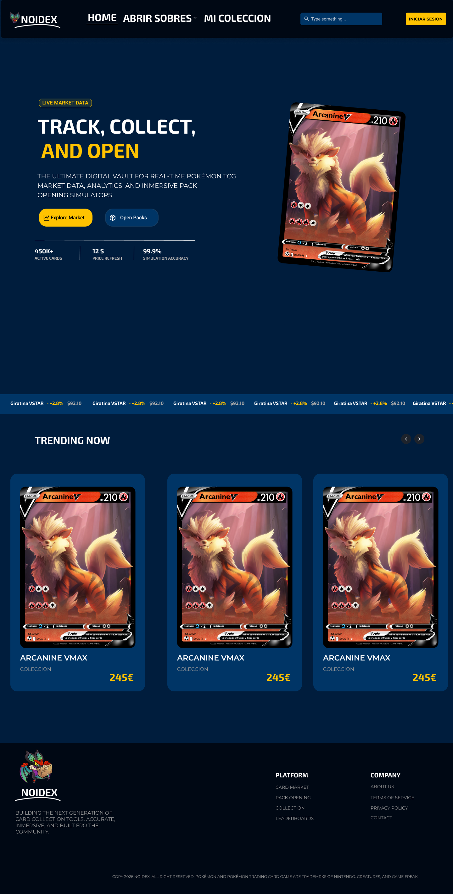
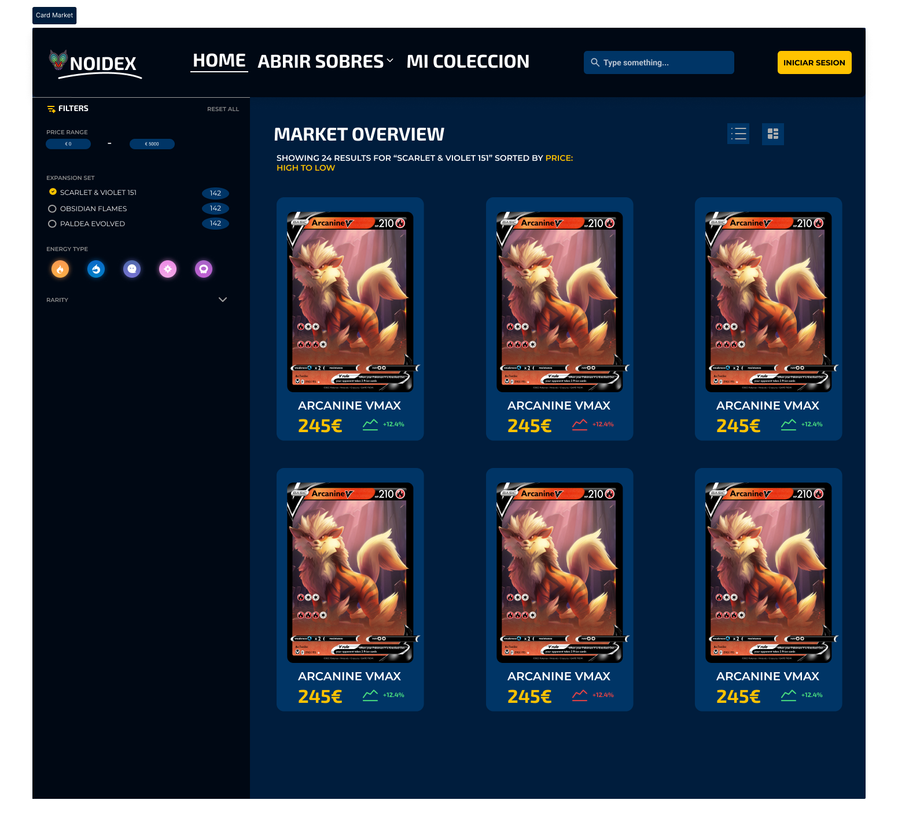

# 🎴 Poke Price Tracker

<div align="center">



Una aplicación completa para el seguimiento de precios de cartas del Pokémon TCG que agrega datos de múltiples fuentes y proporciona históricos de precios detallados.

[](LICENSE)
[](https://nodejs.org/)
[](https://www.postgresql.org/)

</div>

---

## 📋 Tabla de Contenidos

- [Características](#-características)
- [Capturas de Pantalla](#-capturas-de-pantalla)
- [Instalación y Configuración](#-instalación-y-configuración)
- [Cómo Usar](#-cómo-usar)
- [Arquitectura del Proyecto](#-arquitectura-del-proyecto)
- [Stack Tecnológico](#-stack-tecnológico)
- [Estructura del Proyecto](#-estructura-del-proyecto)
- [API Endpoints](#-api-endpoints)
- [Tareas Programadas](#-tareas-programadas)
- [Ramas del Proyecto](#-ramas-del-proyecto)
- [Licencia](#-licencia)

---

## ✨ Características

- 🎯 **Agregación de Precios Multi-Fuente**: Combina precios de TCGPlayer y Cardmarket
- 🔄 **Actualizaciones Automáticas**: Sincronización programada de precios según popularidad
- 📊 **Seguimiento Histórico**: Historial completo de precios para todas las cartas
- 💱 **Conversión de Divisas**: Conversión automática EUR/USD en tiempo real
- ⚡ **Prioridad Inteligente**: Cartas populares se actualizan cada hora, cartas normales cada 6 horas
- 🚀 **Procesamiento por Lotes**: Población eficiente de precios iniciales para grandes datasets
- 🔗 **Sincronización de Sets y Cartas**: Sincronización automática con la API de TCGdex
- 🎨 **Interfaz Moderna**: Frontend desarrollado con Next.js y Tailwind CSS
- 📱 **Diseño Responsive**: Optimizado para dispositivos móviles y desktop

---

## 📸 Capturas de Pantalla

### Página Principal


_Vista principal de la aplicación mostrando el catálogo de cartas_

### Mercado de Cartas


_Listado de cartas disponibles con precios actualizados_

### Detalle de Precios Individuales


_Vista detallada del histórico de precios de una carta específica_

### Guía de Estilos


_Sistema de diseño y guía de estilos del proyecto_

---

## 🏗️ Arquitectura del Proyecto

El proyecto está dividido en dos ramas principales:

- **`feature/backend`**: API REST con Node.js y Express
- **`feature/frontend-base`**: Aplicación frontend con Next.js

```
┌─────────────────┐
│   Next.js App   │ ← Frontend (feature/frontend-base)
│   (React 18)    │
└────────┬────────┘
         │ HTTP/REST
         ▼
┌─────────────────┐
│  Express API    │ ← Backend (feature/backend)
│   (Node.js)     │
└────────┬────────┘
         │
         ├──► TCGdex API (Sets & Cards)
         ├──► Pokémon TCG API (TCGPlayer Prices)
         ├──► Cardmarket API (EUR Prices)
         ├──► Exchange Rate API (Currency)
         │
         ▼
┌─────────────────┐
│   PostgreSQL    │
│   (Supabase)    │
└─────────────────┘
```

---

## 🛠 Stack Tecnológico

### Backend (feature/backend)

- **Runtime**: Node.js 18+
- **Framework**: Express.js
- **Base de Datos**: PostgreSQL (Supabase)
- **Scheduling**: node-cron
- **HTTP Client**: fetch JavaScript
- **APIs Externas**:
  - [TCGdex API](https://api.tcgdex.net) - Datos de cartas
  - [Pokémon TCG API](https://pokemontcg.io) - Precios TCGPlayer
  - Cardmarket API - Precios europeos
  - [Exchange Rate API](https://open.er-api.com) - Conversión de divisas

### Frontend (feature/frontend-base)

- **Framework**: Next.js 14+ (App Router)
- **UI Library**: React 18
- **Estilos**: Tailwind CSS
- **Gestión de Estado**: React Context / Hooks
- **HTTP Client**: Fetch API

---

## 📁 Estructura del Proyecto

```
Poke-Price-Tracker/
│
├── backend/                    # API REST (rama: feature/backend)
│   ├── index.js               # Punto de entrada
│   ├── package.json
│   ├── .env                   # Variables de entorno
│   └── src/
│       ├── app.js            # Configuración Express
│       ├── config/
│       │   ├── db.js         # Conexión a PostgreSQL
│       │   └── schema.sql    # Schema de la BD
│       ├── controllers/      # Controladores de rutas
│       │   ├── card.controller.js
│       │   ├── price.controller.js
│       │   └── sync.controller.js
│       ├── jobs/
│       │   └── scheduler.cron.js  # Tareas programadas
│       ├── routes/           # Definición de rutas
│       │   ├── card.routes.js
│       │   ├── price.routes.js
│       │   ├── sync.routes.js
│       │   └── mainRouter.js
│       ├── services/         # Lógica de negocio
│       │   ├── card.service.js
│       │   ├── currency.service.js
│       │   ├── pokemon.service.js
│       │   ├── price.service.js
│       │   └── priceAggregator.service.js
│       └── utils/
│
├── frontend/                  # Aplicación Next.js (rama: feature/frontend-base)
│   ├── components/           # Componentes React
│   ├── app/                  # App Router de Next.js
│   ├── public/               # Recursos estáticos
│   ├── styles/               # Estilos globales
│   └── package.json
│
├── docs/                     # Documentación y recursos
│   └── images/              # Capturas de pantalla
│       ├── inicio.png
│       ├── card-market.png
│       ├── individual-card-price.png
│       └── Guia de estilos.png
│
├── LICENSE                   # Licencia MIT
└── README.md                # Este archivo
```

---

## � Instalación y Configuración

### Requisitos Previos

- **Node.js** v18 o superior
- **PostgreSQL** 13+ (recomendado: Supabase)
- **npm** o **yarn**
- Cuenta en [Pokémon TCG API](https://dev.pokemontcg.io/) (para obtener API key)

### 1. Clonar el Repositorio

```bash
git clone <url-del-repositorio>
cd Poke-Price-Tracker
```

### 2. Configurar la Base de Datos

#### Opción A: Usar Supabase (Recomendado)

1. Crea una cuenta en [Supabase](https://supabase.com/)
2. Crea un nuevo proyecto
3. Ve a **SQL Editor** en el panel de Supabase
4. Ejecuta el script `backend/src/config/schema.sql` completo
5. Guarda las credenciales de conexión (las necesitarás en el paso 3)

#### Opción B: PostgreSQL Local

```bash
# Instalar PostgreSQL (Ubuntu/Debian)
sudo apt-get install postgresql postgresql-contrib

# Crear base de datos
sudo -u postgres createdb pokemon_price_tracker

# Ejecutar schema
sudo -u postgres psql pokemon_price_tracker < backend/src/config/schema.sql
```

### 3. Configurar el Backend

```bash
cd backend

# Instalar dependencias
npm install

# Crear archivo .env
cp .env.example .env
```

Edita el archivo `.env` con tus credenciales:

```env
# Database (Supabase PostgreSQL)
DB_HOST=aws-0-eu-central-1.pooler.supabase.com
DB_PORT=5432
DB_NAME=postgres
DB_USER=postgres.xxxxxxxxxxxxx
DB_PASSWORD=tu_password_de_supabase

# APIs Externas
POKEMON_TCG_API_KEY=tu_api_key_aqui
POKEMON_TCG_API_URL=https://api.pokemontcg.io/v2
TCGDEX_API_URL=https://api.tcgdex.net/v2/en

# Servidor
PORT=3000
NODE_ENV=development
```

**Obtener API Key de Pokémon TCG:**

1. Visita [https://dev.pokemontcg.io/](https://dev.pokemontcg.io/)
2. Regístrate gratuitamente
3. Copia tu API key y pégala en el `.env`

### 4. Iniciar el Backend

```bash
# Modo desarrollo (con nodemon)
npm run dev

# O en modo producción
npm start
```

El servidor estará disponible en `http://localhost:3000`

### 5. Sincronización Inicial de Datos

Una vez el backend esté corriendo, ejecuta estos comandos para poblar la base de datos:

```bash
# 1. Sincronizar sets de cartas
curl http://localhost:3000/api/sync/sets

# 2. Sincronizar cartas de un set específico (ejemplo: Base Set)
curl http://localhost:3000/api/sync/cards/base1

# 3. Sincronizar todas las cartas (proceso largo)
curl http://localhost:3000/api/sync/all-cards

# 4. Actualizar precios (después de tener cartas)
curl -X POST "http://localhost:3000/api/prices/update-aggregated/base1-4"
```

### 6. Configurar el Frontend (Opcional)

```bash
cd ../frontend

# Instalar dependencias
npm install

# Configurar variables de entorno
echo "NEXT_PUBLIC_API_URL=http://localhost:3000" > .env.local

# Iniciar en modo desarrollo
npm run dev
```

El frontend estará disponible en `http://localhost:3001`

---

## 📡 API Endpoints

Para ver la documentación completa del API, consulta [API_DOCUMENTATION.md](backend/API_DOCUMENTATION.md).

### Principales Endpoints

#### Sincronización

| Método | Endpoint                 | Descripción                 |
| ------ | ------------------------ | --------------------------- |
| `GET`  | `/api/sync/sets`         | Sincroniza todos los sets   |
| `GET`  | `/api/sync/cards/:setId` | Sincroniza cartas de un set |
| `GET`  | `/api/sync/all-cards`    | Sincroniza todas las cartas |

#### Cartas

| Método | Endpoint               | Descripción                     |
| ------ | ---------------------- | ------------------------------- |
| `GET`  | `/api/cards/search?q=` | Buscar cartas por nombre        |
| `GET`  | `/api/cards/:id`       | Detalles de carta con historial |
| `GET`  | `/api/cards/filter`    | Filtrar por múltiples criterios |

#### Precios

| Método | Endpoint                                | Descripción               |
| ------ | --------------------------------------- | ------------------------- |
| `POST` | `/api/prices/update-aggregated/:cardId` | Actualiza precio agregado |
| `GET`  | `/api/cards/:id/price-range`            | Rango de precios          |

---

## 💡 Cómo Usar

### Consultar Precios de una Carta

```bash
# 1. Buscar cartas de Charizard
curl "http://localhost:3000/api/cards/search?q=charizard"

# 2. Ver detalles completos (con historial)
curl "http://localhost:3000/api/cards/base1-4"

# 3. Actualizar precio actual
curl -X POST "http://localhost:3000/api/prices/update-aggregated/base1-4"
```

### Explorar Sets de Cartas

```bash
# Listar todas las series
curl "http://localhost:3000/api/sets/series"

# Ver sets de una serie específica
curl "http://localhost:3000/api/sets/series/Base"

# Detalles de un set con estadísticas
curl "http://localhost:3000/api/sets/base1/stats"
```

### Filtrar Cartas

```bash
# Cartas raras entre 10€ y 100€
curl "http://localhost:3000/api/cards/filter?rarity=Rare&minPrice=10&maxPrice=100&currency=eur"

# Top 20 cartas más caras en USD
curl "http://localhost:3000/api/cards/expensive?limit=20&currency=usd"

# Cartas con tendencia al alza (últimas 24h)
curl "http://localhost:3000/api/cards/trending/price-increase?period=24h"
```

### Comparar Precios

```bash
# Comparar 3 cartas diferentes
curl "http://localhost:3000/api/cards/compare?ids=base1-4,base1-2,base1-15"
```

---

## ⏰ Tareas Programadas

El sistema ejecuta automáticamente las siguientes tareas mediante `node-cron`:

| Tarea                        | Programación         | Descripción                                            |
| ---------------------------- | -------------------- | ------------------------------------------------------ |
| **Sincronización de Sets**   | Diaria a las 3:00 AM | Sincroniza todos los sets desde TCGdex                 |
| **Sincronización de Cartas** | Cada 12 horas        | Actualiza datos de todas las cartas                    |
| **Cartas Populares**         | Cada hora            | Actualiza precios de cartas frecuentemente consultadas |
| **Cartas Normales**          | Cada 6 horas         | Actualiza precios de cartas menos populares            |

Configuración en: [backend/src/jobs/scheduler.js](backend/src/jobs/scheduler.js)

---

## 🌿 Ramas del Proyecto

El proyecto utiliza un flujo de trabajo basado en ramas:

### Rama Principal

- **`main`**: Rama principal estable del proyecto

### Ramas de Features

- **`feature/backend`**: Desarrollo del API REST y servicios backend
  - Incluye: Express API, servicios, controladores, cron jobs
  - Para trabajar en backend: `git checkout feature/backend`
- **`feature/frontend-base`**: Desarrollo de la interfaz de usuario
  - Incluye: Next.js app, componentes React, estilos
  - Para trabajar en frontend: `git checkout feature/frontend-base`

---

## � Solución de Problemas

### Error: "Cannot connect to database"

**Solución:**

- Verifica que las credenciales en `.env` sean correctas
- Asegúrate de que Supabase esté configurado correctamente
- Comprueba la conexión: `psql -h DB_HOST -U DB_USER -d DB_NAME`

### Error: "POKEMON_TCG_API_KEY is required"

**Solución:**

1. Regístrate en [https://dev.pokemontcg.io/](https://dev.pokemontcg.io/)
2. Copia tu API key
3. Añádela al archivo `.env`

### El servidor no inicia en el puerto 3000

**Solución:**

- El puerto puede estar ocupado. Cambia el `PORT` en `.env`
- O cierra el proceso que está usando el puerto: `lsof -ti:3000 | xargs kill -9`

### No hay datos después de la sincronización

**Solución:**

```bash
# Ejecuta manualmente la sincronización en orden:
curl http://localhost:3000/api/sync/sets
curl http://localhost:3000/api/sync/cards/base1
curl http://localhost:3000/api/sync/all-cards
```

### Error: "Schema not found"

**Solución:**

- Ejecuta el archivo `backend/src/config/schema.sql` en Supabase SQL Editor
- Verifica que todas las tablas se hayan creado correctamente

---

## �📝 Licencia

Este proyecto está bajo la Licencia MIT. Ver el archivo [LICENSE](LICENSE) para más detalles.

---

## 📧 Contacto

Para preguntas o soporte, por favor abre un issue en el repositorio.

---

## 🙏 Agradecimientos

- [TCGdex](https://www.tcgdex.net/) - Por proporcionar datos completos de cartas
- [Pokémon TCG API](https://pokemontcg.io/) - Por los precios de TCGPlayer
- [Supabase](https://supabase.com/) - Por el hosting de PostgreSQL
- Comunidad de Pokémon TCG

---

<div align="center">

**Hecho con ❤️ para la comunidad Pokémon TCG**

⭐ Si este proyecto te resulta útil, considera darle una estrella!

</div>
